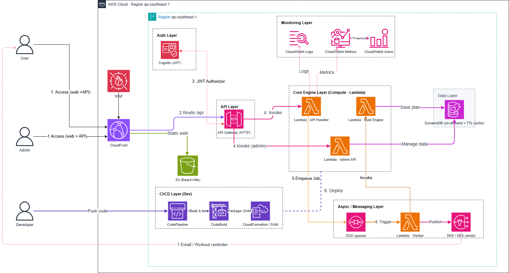

# PERIODIQ - SERVERLESS PERIODIZATION ENGINE

## Ứng dụng sinh giáo án tập luyện tự động trên AWS Serverless

### 1. Tóm tắt điều hành

PeriodIQ là một nền tảng web serverless đóng vai trò như một huấn luyện viên cá nhân tự động. Người dùng nhập các thông tin tập luyện như cân nặng, trình độ, mục tiêu tập, số buổi mỗi tuần, Personal Records, giới hạn thể chất và thiết bị hiện có. Hệ thống sau đó sinh ra giáo án tập luyện cá nhân hóa trong 4 tuần, gồm bài tập, số set, số rep, RPE, thời gian nghỉ và target weight.

Dự án được xây dựng bởi team 5 người bằng các dịch vụ AWS serverless. Vai trò của tôi là **Trần Anh Tài - Rule Engine & Sinh giáo án**, phụ trách luồng API sinh giáo án, logic Lambda Rule Engine, hành vi giao diện Workout Plan, output `WorkoutPlan`, và kiểm chứng kết quả qua DynamoDB cùng CloudWatch logs.

Link dự án đang chạy: <https://d1di1pzmfypszp.cloudfront.net>

### 2. Tuyên bố vấn đề

**Vấn đề là gì?** Phần lớn người tập gym sử dụng các giáo án tĩnh từ internet, sách hoặc huấn luyện viên. Các giáo án này thường không xét đến trình độ cá nhân, sức mạnh hiện tại, khả năng hồi phục, số ngày tập trong tuần, giới hạn thể chất hoặc mức độ mệt mỏi gần đây. Vì vậy người dùng có thể tập quá nhẹ, không có progression, hoặc tập quá nặng với nhiều buổi có áp lực CNS cao, làm tăng nguy cơ chấn thương và quá tải.

**Giải pháp** PeriodIQ tự động hóa periodization dựa trên luật qua 3 bước Rule Engine:

1. **Volume Filter** - kiểm soát training volume theo mục tiêu, trình độ và số buổi mỗi tuần.
2. **Conflict Resolution** - tránh các tổ hợp không an toàn như quá nhiều bài high-CNS hoặc xung đột với giới hạn thể chất.
3. **Progression Builder** - tạo cấu trúc 4 tuần: Week 1 base volume, Week 2 volume overload, Week 3 peak intensity và Week 4 deload.

Người dùng có thể tạo và xem giáo án ngay trên giao diện web. Giáo án được lưu vào DynamoDB và hiển thị lại với progression theo tuần, chia ngày tập, danh sách bài tập, set/rep targets, target RPE, rest time và target weight.

**Lợi ích và giá trị**

* Cá nhân hóa giáo án dựa trên khoa học tập luyện mà không cần huấn luyện viên cập nhật thủ công mỗi lần.
* Tăng độ an toàn nhờ kiểm soát volume, conflict rules và tuần deload.
* Là dự án serverless thực tế, có đủ authentication, API, compute, data, async messaging, monitoring và CI/CD.
* Chi phí thấp khi ít người dùng vì kiến trúc dựa trên các dịch vụ AWS pay-per-use.

### 3. Kiến trúc giải pháp

Hệ thống được deploy ở AWS region `ap-southeast-1` và chia thành nhiều tầng: Edge/Frontend, Auth, API, Core Engine, Data, Async/Messaging, Monitoring và CI/CD.

**Luồng request chính - Generate Workout Plan**

1. Người dùng truy cập web app React/Vite thông qua CloudFront.
2. CloudFront phục vụ static frontend từ S3 và route API requests đến API Gateway.
3. API Gateway nhận authenticated requests và chuyển request sinh giáo án đến backend Lambda path.
4. API Handler kiểm tra request và gọi logic Rule Engine.
5. Rule Engine đọc input người dùng và dữ liệu hồ sơ liên quan, sau đó chạy Volume Filter, Conflict Resolution và Progression Builder.
6. Giáo án 4 tuần được lưu vào DynamoDB dưới dạng item `WorkoutPlan`.
7. API trả kết quả về frontend để người dùng xem giáo án ngay.
8. CloudWatch ghi lại Lambda execution logs và API behavior để kiểm chứng.
9. Sau khi sinh giáo án, một message bất đồng bộ có thể tiếp tục luồng notification/progress mà không chặn response chính.

### Các dịch vụ AWS sử dụng

| # | Dịch vụ | Tầng | Vai trò |
| --- | --- | --- | --- |
| 1 | AWS WAF | Edge/Security | Hỗ trợ bảo vệ public entry points khỏi các tấn công web phổ biến |
| 2 | Amazon CloudFront | Edge | CDN cho frontend React/Vite và routing layer cho public site |
| 3 | Amazon S3 | Frontend | Host static frontend build files |
| 4 | Amazon Cognito | Auth | Xác thực người dùng và cấp JWT |
| 5 | Amazon API Gateway | API | Nhận API requests và route đến Lambda |
| 6 | AWS Lambda - API Handler | Core Engine | Xử lý backend requests từ user |
| 7 | AWS Lambda - Rule Engine | Core Engine | Sinh giáo án cá nhân hóa trong 4 tuần |
| 8 | AWS Lambda - Admin API | Core Engine | Hỗ trợ thao tác dữ liệu admin |
| 9 | Amazon DynamoDB | Data | Lưu user profile, rules, templates, progress và generated plans |
| 10 | Amazon SQS | Async | Queue các tác vụ bất đồng bộ sau request chính |
| 11 | AWS Lambda - Worker | Async | Xử lý queued messages |
| 12 | Amazon SNS / Amazon SES | Notification | Gửi notifications và email liên quan đến giáo án |
| 13 | Amazon CloudWatch | Monitoring | Logs, metrics và alarms |
| 14 | AWS CodePipeline | CI/CD | Điều phối deployment pipeline |
| 15 | AWS CodeBuild | CI/CD | Build và test backend/frontend code |
| 16 | AWS CloudFormation / SAM | IaC | Định nghĩa và deploy infrastructure |

### Thiết kế thành phần

* **Edge & Frontend:** React 19 + Vite SPA host trên S3 và phục vụ qua CloudFront.
* **Auth:** Cognito xử lý đăng nhập và cấp JWT cho backend APIs.
* **API:** API Gateway expose các HTTP routes như `POST /api/workoutplans/generate`.
* **Core Engine:** Backend path chạy trên Lambda, gồm API Handler và Rule Engine logic.
* **Data:** DynamoDB lưu master data, user profiles, records, tracking data, rule definitions và generated `WorkoutPlan`.
* **Async/Messaging:** SQS tách các tác vụ tiếp theo như notification hoặc progress processing khỏi request chính.
* **Monitoring:** CloudWatch logs và metrics giúp kiểm tra execution và troubleshoot.
* **CI/CD:** CodePipeline, CodeBuild và CloudFormation/SAM hỗ trợ deploy lặp lại được.

### 4. Triển khai kỹ thuật

**Cơ cấu team** - dự án được chia cho 5 thành viên:

* Lê Hoài Huân - Auth & User Profile: Cognito, WAF, CloudFront.
* **Trần Anh Tài - Rule Engine & Sinh giáo án:** Lambda API Handler, Lambda Rule Engine, S3-hosted Workout Plan UI.
* Lê Hữu Duy Hoàng - Progress & Async Notification: SQS, Lambda Worker, SNS/SES.
* Chương Tử Luân - Admin Panel & Data: DynamoDB, Lambda Admin API, API Gateway.
* Phạm Văn Sỹ - CI/CD & Monitoring: CodePipeline, CodeBuild, CloudFormation/SAM, CloudWatch.

**Phần triển khai chính của tôi**

* Xác định input contract của Workout Plan: goal, fitness level, days/week, start date, current 1RM, limitations và equipment.
* Implement hoặc refine `POST /api/workoutplans/generate`.
* Implement các stage của Rule Engine: Volume Filter, Conflict Resolution và Progression Builder.
* Lưu giáo án đã sinh vào DynamoDB với nested output `Weeks`.
* Kiểm tra product flow: generate plan, xem My Plans, mở detail và kiểm tra weekly progression.
* Xác minh execution bằng CloudWatch logs và DynamoDB records.

**Tech stack**

* Backend: .NET, ASP.NET Core Web API, Lambda hosting, Clean Architecture, DynamoDB SDK.
* Frontend: React, Vite, Tailwind CSS, Axios, React Router.
* Cloud: AWS Lambda, API Gateway, DynamoDB, S3, CloudFront, Cognito, SQS, CloudWatch, CodePipeline, CodeBuild, CloudFormation/SAM.

### 5. Lộ trình & mốc triển khai

* **Tuần 1-5:** Học các dịch vụ AWS nền tảng qua lab: account setup, IAM, VPC, EC2, S3, DynamoDB, CloudWatch và security basics.
* **Tuần 6:** Map kiến thức serverless backend vào request path của PeriodIQ Rule Engine.
* **Tuần 7:** Xác định luồng Workout Plan có authentication và yêu cầu input API.
* **Tuần 8:** Thiết kế Rule Engine logic và output DynamoDB `WorkoutPlan.Weeks`.
* **Tuần 9:** Bắt đầu implement Rule Engine và endpoint sinh giáo án.
* **Tuần 10:** Hoàn thành user-facing Workout Plan flow và kiểm tra output đã sinh.
* **Tuần 11:** Xác minh AWS resources, DynamoDB records và CloudWatch logs.
* **Tuần 12:** Hoàn thiện demo, workshop pages, nội dung báo cáo và ghi chú shared resources.

### 6. Ước tính ngân sách

PeriodIQ sử dụng kiến trúc chủ yếu là serverless và pay-per-use. Với một capstone deployment quy mô nhỏ, traffic thấp, các yếu tố chi phí chính gồm:

* **AWS Lambda:** tính phí theo request và thời gian chạy; với traffic thấp thì chi phí rất nhỏ.
* **Amazon DynamoDB:** on-demand billing tăng giảm theo số lần đọc/ghi thực tế thay vì provisioned capacity cố định.
* **Amazon API Gateway:** tính phí theo số API request.
* **Amazon CloudFront + S3:** chi phí thấp cho SPA nhỏ và request volume thấp.
* **Amazon SQS / SNS / SES:** message volume thấp, phù hợp free tier cho quy mô nhỏ.
* **CodePipeline / CodeBuild:** chi phí phụ thuộc vào pipeline đang hoạt động và số phút build.

Không đưa fixed AWS Pricing Calculator estimate vì chi phí thực tế phụ thuộc vào traffic và cách sử dụng sau cùng. Kiến trúc được chọn để giữ idle cost thấp và marginal cost gần bằng 0 ở quy mô nhỏ.

### 7. Đánh giá rủi ro

* **Rule tính sai dẫn đến giáo án không an toàn** - giảm thiểu bằng Volume Filter, Conflict Resolution rules, test scenarios và review output cuối.
* **Frontend/backend integration bị lỗi** - giảm thiểu bằng kiểm thử full product flow từ CloudFront frontend đến API Gateway, Lambda, DynamoDB và quay lại UI.
* **Lỗi authentication hoặc API authorization** - giảm thiểu bằng Cognito JWT và kiểm tra authenticated request behavior.
* **DynamoDB schema không khớp** - giảm thiểu bằng cách định nghĩa sớm cấu trúc output `WorkoutPlan` và kiểm tra records thật trong DynamoDB.
* **Lambda/runtime errors** - giảm thiểu bằng CloudWatch logs, API response checks và repeated generation tests.
* **Deployment drift hoặc frontend build bị cache cũ** - giảm thiểu bằng CI/CD verification và kiểm tra CloudFront deployment.

### 8. Kết quả kỳ vọng

* Một ứng dụng serverless public hoạt động được để sinh giáo án tập luyện cá nhân hóa trong 4 tuần.
* Feature Rule Engine hoàn chỉnh, chuyển input tập luyện của user thành giáo án theo tuần có cấu trúc.
* Luồng user rõ ràng: đăng nhập, mở Workout Plan, generate plan, xem danh sách plan và xem chi tiết.
* Minh chứng AWS được xác minh từ Lambda, API Gateway, S3/CloudFront, DynamoDB, CloudWatch và SQS.
* Kết quả học tập có thể tái sử dụng cho các ứng dụng serverless .NET và React trên AWS sau này.

Kết quả live: <https://d1di1pzmfypszp.cloudfront.net>
