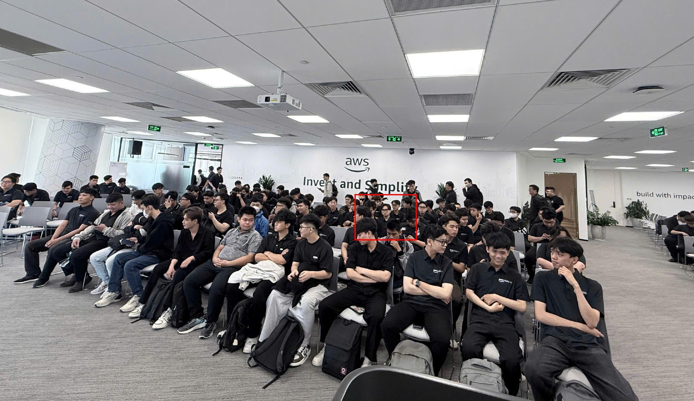

# Tôi học được gì từ FCAJ Community Day: Thói quen học và tư duy AI-ready

### Thông tin sự kiện

* **Tên sự kiện:** FCAJ Community Day
* **Thời gian:** 09:00, ngày 09/05/2026
* **Địa điểm:** TP. Hồ Chí Minh
* **Vai trò:** Người tham dự

### Minh chứng tham gia

### Cảm nhận chung

Tôi tham gia buổi FCAJ Community Day này cùng bạn bè. Buổi meetup hữu ích vì không chỉ giới thiệu các công cụ AI, mà còn giúp tôi hiểu cách sinh viên và developer nên xây dựng thói quen học tập, sử dụng AI có trách nhiệm hơn và tổ chức công việc phát triển phần mềm có AI hỗ trợ.

Trước buổi meetup, tôi thường dùng AI theo cách khá đơn giản: đặt câu hỏi, nhận câu trả lời, rồi tự chỉnh lại. Sau khi nghe các phần chia sẻ, tôi nhận ra cách làm này chưa đủ cho công việc thực tế. Nếu muốn AI thật sự hữu ích trong học tập hoặc phát triển phần mềm, tôi cần có quy trình rõ hơn, biết cách đánh giá output và vẫn phải giữ nền tảng kỹ thuật vững.

### Diễn giả và chủ đề chính

* **Huỳnh Hoàng Long** - thói quen học tập và cách làm việc học trở nên hấp dẫn hơn.
* **Nguyễn Tuấn Thịnh** - automated prompt engineering và cải thiện chất lượng output của LLM.
* **Khang** - "AI-ready" thật sự có ý nghĩa gì với sinh viên mới ra trường.
* **Thảo** - BMAD Method cho quy trình phát triển phần mềm có AI hỗ trợ.

### Những điều tôi học được

#### 1. Việc học cần được thiết kế như một hệ thống

Một ý làm tôi nhớ nhất là việc học cũng cần được thiết kế như một hệ thống. Mạng xã hội giữ người dùng quay lại vì nó có vòng lặp rõ ràng: trigger, action, reward và investment. Diễn giả giải thích rằng cùng một tư duy đó có thể được dùng theo hướng tốt hơn cho việc học.

Điều này khiến tôi nhìn lại thói quen học của mình. Nếu chỉ dựa vào động lực thì việc học sẽ không ổn định. Cách tốt hơn là tạo ra những hành động nhỏ nhưng lặp lại được, ví dụ ghi chú sau mỗi bài lab, theo dõi tiến độ hằng ngày và tổng kết cuối tuần. Điều này cũng giống với cách tôi viết worklog theo tuần trong kỳ thực tập.

#### 2. Prompt engineering cần được đo lường

Phần automated prompt engineering giúp tôi hiểu rằng chất lượng prompt không nên chỉ đánh giá bằng cảm giác. Một thay đổi nhỏ trong câu chữ có thể làm output của LLM khác đi, vì vậy cải thiện prompt nên được xem như một quy trình kỹ thuật.

Tôi học được rằng cách tốt hơn là xác định output mong muốn, tạo một vài test case, so sánh nhiều phiên bản prompt và giữ lại phiên bản cho kết quả ổn định nhất. Điều này hữu ích khi tôi dùng AI để hỗ trợ viết báo cáo, giải thích code hoặc soạn tài liệu kỹ thuật.

#### 3. "AI-ready" vẫn cần nền tảng kỹ thuật chắc

Phần AI-ready fresher rất quan trọng với tôi vì tôi vẫn là sinh viên. Tôi nhận ra rằng biết dùng AI tool chưa đủ để tạo khác biệt. AI có thể sinh code hoặc giải thích, nhưng tôi vẫn phải hiểu programming fundamentals, debugging, system thinking, Git, testing và code review.

Bài học chính là AI nên hỗ trợ kỹ sư, chứ không thay thế tư duy kỹ thuật. Nếu tôi chấp nhận output của AI mà không kiểm tra, tôi có thể tạo bug hoặc hiểu sai vấn đề. Điều này đặc biệt quan trọng trong cloud project, vì một lỗi cấu hình nhỏ có thể ảnh hưởng đến security, cost hoặc availability.

#### 4. Phát triển phần mềm với AI cần có cấu trúc

Phần BMAD Method cho tôi thấy một cách dùng AI có cấu trúc hơn trong phát triển phần mềm. Thay vì dùng một đoạn chat dài cho mọi việc, workflow có thể chia thành các vai trò rõ hơn như analyst, product manager, architect, developer và QA.

Tôi học được rằng cách chia vai trò này giúp dự án dễ kiểm soát hơn. Mỗi vai trò tạo ra một output rõ ràng, và bước sau có thể tiếp tục từ output đó. Cách này tốt hơn việc yêu cầu AI làm planning, architecture, coding, testing và documentation trong một cuộc trò chuyện không có cấu trúc.

### Áp dụng vào kỳ thực tập

Sau buổi meetup, tôi áp dụng được một số ý vào công việc thực tập:

* Viết worklog đều hơn bằng cách xem báo cáo tuần như một learning loop nhỏ.
* Cẩn thận hơn khi dùng AI để chỉnh nội dung kỹ thuật, vì output vẫn cần kiểm tra lại.
* Cung cấp context rõ hơn khi nhờ AI hỗ trợ viết tài liệu, đặc biệt là phần PeriodIQ.
* Chú ý nhiều hơn đến nền tảng như hành vi của AWS services, API flow, DynamoDB output và CloudWatch logs thay vì chỉ dựa vào phần giải thích được sinh ra.
* Nhìn rõ hơn vai trò của tôi trong PeriodIQ: input contract, Rule Engine logic, generated output và validation cần được tách ra, mô tả từng bước.

### Kết luận cá nhân

Buổi meetup giúp tôi hiểu rằng AI chỉ thật sự hữu ích khi được sử dụng có kỷ luật. Điều giá trị nhất với tôi không phải là một công cụ cụ thể, mà là tư duy: học tập tốt và prompting tốt đều cần một quy trình.

Đối với kỳ thực tập, sự kiện này giúp tôi cải thiện cách học, cách viết tài liệu và cách kiểm tra output có AI hỗ trợ. Nó cũng nhắc tôi rằng với vai trò fresher, nền tảng kỹ thuật vẫn là quan trọng nhất. AI có thể giúp tôi làm nhanh hơn, nhưng không thay thế trách nhiệm hiểu và kiểm chứng công việc của chính mình.
