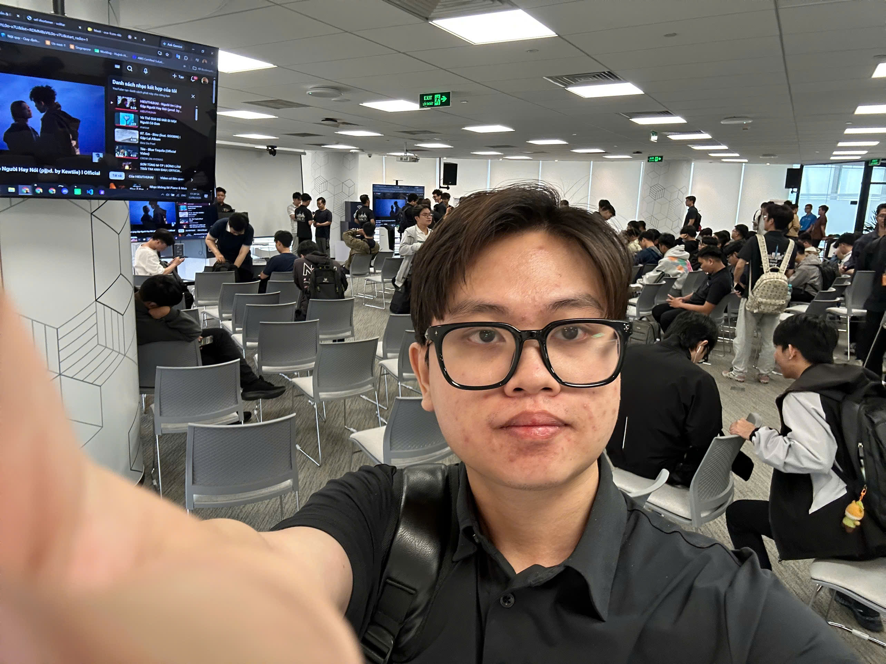

# Tôi học được gì từ FCAJ Community Day

### Thông tin sự kiện

* **Tên sự kiện:** FCAJ Community Day
* **Thời gian:** Thứ Bảy, ngày 23/05/2026, 09:00 - 12:00 GMT+7
* **Địa điểm:** Bitexco Financial Tower, 2 đường Hải Triều, phường Sài Gòn, TP. Hồ Chí Minh, Việt Nam
* **Vai trò:** Người tham dự

### Minh chứng tham gia

### Diễn giả và chủ đề chính

* **Tinh Truong** - thiết kế context và cách làm AI thật sự hữu ích.
* **Anh Pham** - workflow với AI assistant thông qua Amazon Quick.
* **Thinh Nguyen** - CloudFront từ edge đến origin và lý do CloudFront là nền tảng quan trọng.
* **Team VIB** - xây dựng UTMorpho từ ý tưởng đến demo trong hackathon 36 giờ.
* **Duc Dao** - tính không hoàn toàn deterministic của LLM dù cấu hình trông có vẻ deterministic.
* **Vy Lam** - thiết kế enterprise-grade multi-agent system cho bài toán startup credit scoring.

### Cảm nhận chung

FCAJ Community Day đối với tôi không giống một buổi học lý thuyết thông thường. Buổi này giống một meetup cộng đồng hơn, nơi tôi được nghe các anh chị kỹ sư, sinh viên và builder chia sẻ cách họ dùng AI và AWS trong các dự án thực tế.

Trước khi tham gia meetup, tôi chủ yếu xem AI như một công cụ để hỏi đáp hoặc hỗ trợ viết code. Sau buổi này, tôi hiểu rằng AI chỉ thật sự hữu ích khi được đặt trong một workflow rõ ràng, có đủ context và kết hợp với thiết kế hệ thống tốt. Tôi cũng học được rằng cloud architecture không chỉ là chọn dịch vụ AWS, mà còn phải nghĩ đến performance, cost, security, reliability và trải nghiệm người dùng.

### Những điều tôi học được

#### 1. AI cần context tốt, không chỉ cần prompt tốt

Phần chia sẻ về context giúp tôi hiểu vì sao có lúc AI trả lời rất hữu ích, nhưng có lúc lại chung chung. Một prompt ngắn chưa đủ để có kết quả tốt. Chất lượng câu trả lời phụ thuộc vào context mình cung cấp: mục tiêu, ràng buộc, ví dụ, thông tin trước đó và định dạng output mong muốn.

Điều này thay đổi cách tôi sử dụng AI trong kỳ thực tập. Khi viết báo cáo hoặc mô tả dự án AWS, tôi cố gắng đưa bối cảnh rõ hơn trước khi yêu cầu AI hỗ trợ. Ví dụ, khi viết về PeriodIQ, tôi cần nói rõ vai trò của tôi, luồng Rule Engine, input data và output mong muốn trước khi nhờ AI chỉnh lại nội dung.

#### 2. AI có thể hỗ trợ cả workflow, không chỉ là chat

Phần Amazon Quick cho tôi thấy AI assistant không chỉ dùng để trò chuyện. AI có thể hỗ trợ khai thác dữ liệu, tạo workflow, chia sẻ knowledge trong team và tạo dashboard hoặc report từ dữ liệu thô.

Từ phần này, tôi học được rằng một sản phẩm AI hữu ích không nên chỉ dừng ở việc trả lời câu hỏi. Nó cần giúp người dùng giảm công việc lặp lại và hoàn thành task nhanh hơn. Đây là mindset quan trọng cho các dự án sau này, vì giá trị của AI nên được đo bằng việc nó cải thiện workflow ra sao, không chỉ bằng câu trả lời nghe hay đến mức nào.

#### 3. CloudFront không chỉ là CDN

Phần CloudFront là nội dung liên quan trực tiếp nhất đến dự án AWS của tôi. Trước meetup, tôi hiểu CloudFront chủ yếu là dịch vụ giúp website tĩnh tải nhanh hơn. Sau phần chia sẻ, tôi hiểu CloudFront còn là một edge layer quan trọng cho routing, security, performance, reliability và cost optimization.

Điều này giúp tôi hiểu rõ hơn về PeriodIQ vì frontend của dự án được host trên S3 và phục vụ qua CloudFront. Người dùng không truy cập S3 trực tiếp. CloudFront trở thành public entry point, giúp cải thiện tốc độ tải và có thể kết hợp với các lớp bảo vệ như WAF. Nhờ vậy, phần S3 + CloudFront trong dự án trở nên dễ hiểu hơn với tôi.

#### 4. Làm sản phẩm cần biết giảm scope

Phần chia sẻ hackathon về việc xây dựng UTMorpho trong 36 giờ giúp tôi thấy rằng một team không thể làm tất cả mọi thứ cùng lúc. Team cần xác định vấn đề chính, giảm bớt feature không cần thiết, làm main flow trước và chuẩn bị demo rõ ràng.

Bài học này rất liên quan đến project nhóm PeriodIQ. Một hệ thống sinh giáo án tập luyện có thể mở rộng ra rất nhiều phần: user profile, personal records, templates, progress tracking, notifications, admin pages và nhiều loại rule. Nhưng phần quan trọng nhất là phải làm được luồng chính trước: user nhập thông tin -> Rule Engine xử lý -> sinh giáo án 4 tuần -> lưu kết quả -> hiển thị trên UI.

#### 5. Output của LLM vẫn cần kiểm chứng

Phần về non-determinism của LLM khá thú vị vì nó cho thấy ngay cả khi cấu hình trông có vẻ deterministic, output vẫn có thể thay đổi do cách model và inference system hoạt động.

Bài học chính của tôi là không nên tin hoàn toàn vào output của AI. Nếu AI được dùng trong một workflow nghiêm túc, hệ thống cần validation, fallback logic, ràng buộc rõ ràng và human review cho các quyết định quan trọng. Điều này cũng liên hệ với PeriodIQ: dù project của tôi dùng rule-based engine thay vì LLM, giáo án được sinh ra vẫn cần các ràng buộc như volume control, conflict resolution và deload logic để đảm bảo kết quả an toàn.

#### 6. Multi-agent system cần trách nhiệm rõ ràng

Phần cuối về enterprise-grade multi-agent system giúp tôi hiểu rằng dùng nhiều agent không có nghĩa là hệ thống tốt hơn. Mỗi agent cần có vai trò rõ ràng, và toàn hệ thống cần guardrails, compliance checks và lý do thực sự để dùng multi-agent.

Tôi học được rằng architecture phải giải quyết vấn đề thật, không phải chỉ để dùng công nghệ mới. Đôi khi một service hoặc một agent đơn giản sẽ tốt hơn nếu workflow không quá phức tạp. Multi-agent chỉ phù hợp khi bài toán đủ lớn và có thể chia trách nhiệm rõ ràng.

### Tôi áp dụng vào kỳ thực tập như thế nào

Sau meetup, tôi liên hệ được nhiều bài học với công việc thực tập:

* Hiểu rõ hơn luồng frontend S3 + CloudFront trong PeriodIQ.
* Cải thiện cách trình bày context khi viết báo cáo và workshop pages.
* Cẩn thận hơn với việc kiểm chứng output, đặc biệt là các kết quả được sinh tự động.
* Biết cách giải thích một dự án theo hướng problem -> solution -> architecture -> demo, thay vì chỉ liệt kê dịch vụ.
* Hiểu rằng AI và cloud services chỉ thật sự có giá trị khi hỗ trợ được một workflow thực tế của người dùng.

### Kết luận cá nhân

Buổi meetup giúp tôi có góc nhìn rộng hơn về cả AI và AWS. Nó giúp tôi chuyển từ việc chỉ học từng dịch vụ riêng lẻ sang việc suy nghĩ cách kết hợp các dịch vụ và công cụ trong một sản phẩm thật.

Với tôi, bài học giá trị nhất là kỹ thuật tốt không chỉ nằm ở việc dùng công nghệ mới. Điều quan trọng hơn là hiểu vấn đề, cung cấp đủ context cho hệ thống, thiết kế một luồng xử lý đáng tin cậy và đảm bảo kết quả cuối cùng thật sự hữu ích cho người dùng.
